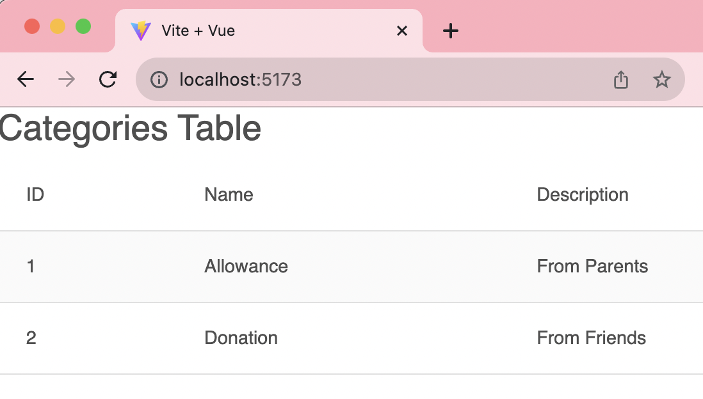

# vue-fintrack-1
 Vue implementation of Financial Tracker App

```bash
$ git clone https://github.com/cbatuic/vue-fintrack-1.git
$ cd vue-fintrack-1
$ npm install
$ npm run dev
```

### Code Snippets
This code displays tabular data in ```Vue JS```.
```html
<table class="table table-striped">
    <thead>
    <tr>
        <th>ID</th>
        <th>Name</th>
        <th>Description</th>
    </tr>
    </thead>
    <tbody>
    <tr v-for="category in categories" :key="category.id">
        <td>{{ category.id }}</td>
        <td>{{ category.name }}</td>
        <td>{{ category.description }}</td>
    </tr>
    </tbody>
</table>
```
> ```<table class="table table-striped">```: This creates an HTML table with the Bootstrap class "table" and "table-striped," which gives the table a striped appearance for better readability.

> ```<thead>```: This section contains the table header, where column headings are defined.

> ```<tr>```: Defines a table row within the table header.

> ```<th>ID</th>```: Defines a table header cell with the text "ID." This is typically the header for the first column.

> ```<th>Name</th>```: Defines a table header cell with the text "Name." This is typically the header for the second column.

> ```<th>Description</th>```: Defines a table header cell with the text "Description." This is typically the header for the third column.

> ```<tbody>```: This section contains the table body, where the actual data is displayed.

> ```<tr v-for="category in categories" :key="category.id">```: This is a Vue.js directive that iterates over the "categories" array and generates a table row for each category. The v-for directive loops through each item in the "categories" array, and :key assigns a unique identifier to each row based on the category's ID.

> ```<td>{{ category.id }}</td>```: Defines a table cell within the row, displaying the category's ID.

> ```<td>{{ category.name }}</td>```: Defines a table cell displaying the category's name.

> ```<td>{{ category.description }}</td>```: Defines a table cell displaying the category's description.
</p>

### Preview



### Challenge

1. Create an ```Add``` functional component which includes user interface to modify **name** and **description** properties.
2. Update the ```Table``` once the changes are saved.

